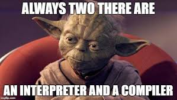
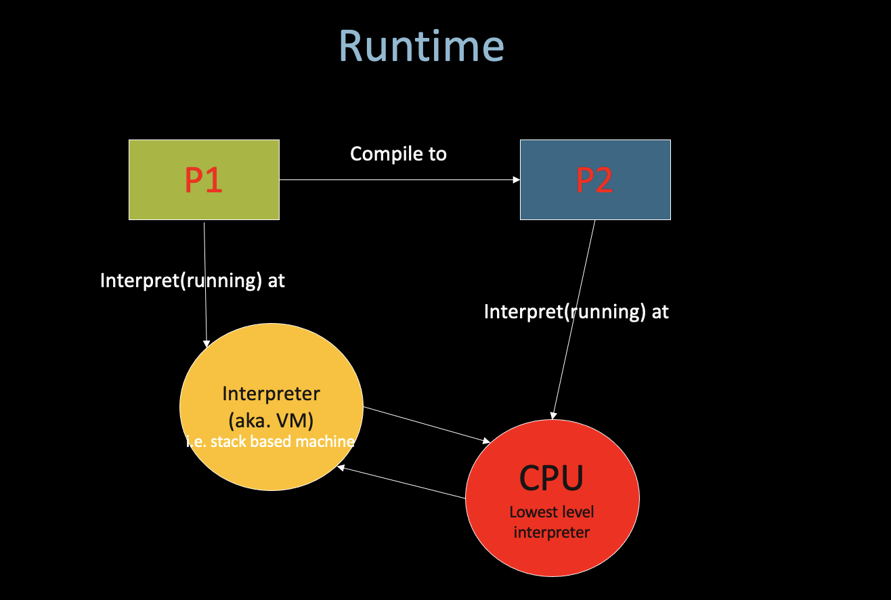
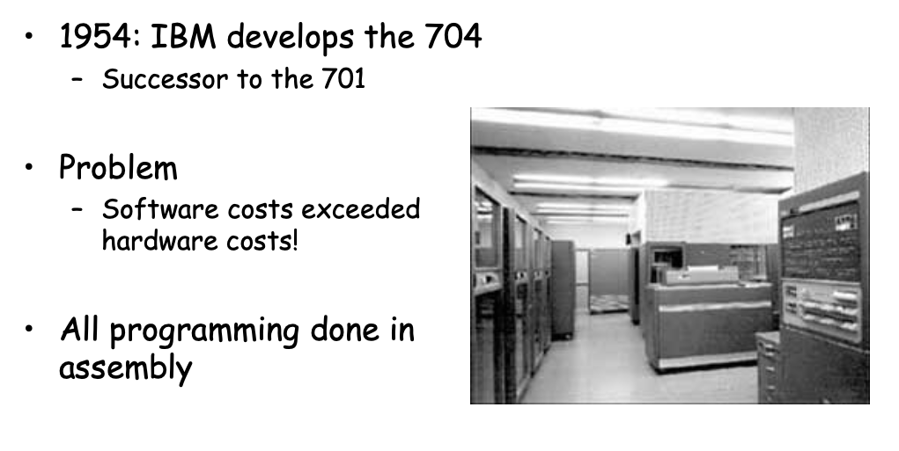
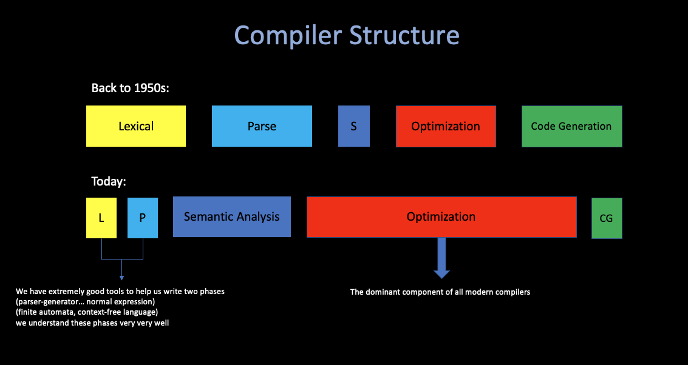
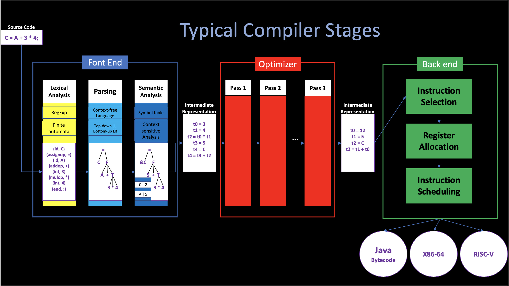

# 1. Introduction

**By Angold Wang | 11/02/2022**

## 1. Compiler

### i. Overview

* **Compilers translate your program**
* **Interpreters run your program**

### ii. Compiler History

In 1954, *[John Backus](https://en.wikipedia.org/wiki/John_Backus)* developed the first high-level language: **FORTRAN (Formula-Translation)**

**Which translate high-level code to assembly, and the performance is close to hand-written assembly!**

* Development time halved
* in 1958 >50% of all software is in FORTRAN.

### iii. Compiler Structure

**FORTRAN I is the first compiler, which brings huge impact on computer science (Many thought this is impossible).**
**And modern compiers preserve the outlines of FORTRAN:**

1. Lexical Analysis
2. Parsing
3. Semantic Analysis
4. Optimiaztion
5. Code Generation

Today, the overall structure of almost every compiler adheres to this outline, but proportions are changed since FORTRAN:

### iv. Compiler Economy

#### Why are there so many programming languages?
**Application Domains have distinctive/conflicting needs.**

* **Scientific Computing** 
    * Good Floating-point support
    * Godd Arrays
    * Parallelism Example: *FORTRAN / Matlab / R*

* **Business Applications**
    * Persistance (Stable, Safe)
    * Report Generation
    * Data Analysis
    * Example: *SQL*

* **System Programming**
    * Control of Resources
    * Real-time constraints
    * Example: *C / C++*

**As you can see, what's important in one domain or most important in one domain is not the same as in another domain. And it is easy to imagine at least that it would be difficult to intergrate all of these into one system that would do good job on all of these things.**

#### Why are there so many new programming languages?

**An interesting claim:**
> Programmer training is the dominant cost for a programming language.

That leads three things: 
1. Widely used languages are slow to change: 
**We would expect the most popular languages, which will have larger and larger programmer basis, to become more and more ossified. To evolve more and more slowly.**

2. Better and easier to start a new language: 
**Since there are new application domains coming along all the time, instead of updating the widely-used languages, which is very hard and costs much as we metioned above, we better like to start a new language. **
**Because you start with zero users and so there is essentially zero training cost at the beginning, the new language can evolve much more quickly to changing situations. And it's just not very costly to experiment with a new language at all.**

3. New languages tend to look like old languages: 
**Reduce the trainning cost, (Java versus C++)**

#### What is a good programming language?

**No "Perfect" Language, each of them has its own domain.**

## 2. Abstractions

#### Structure of a typical compiler

**To reduce complexity, and create a more modular system. We divide the whole compiler into different _stages_, and each stages is the procedure of multiple _passes_.**

