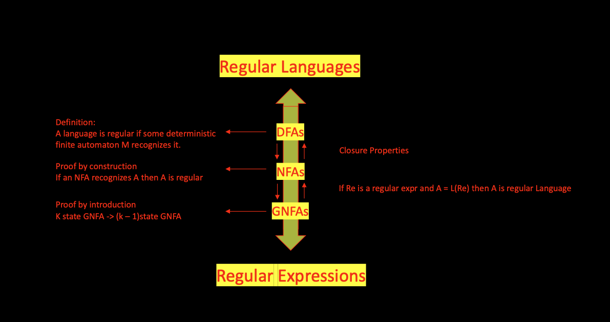
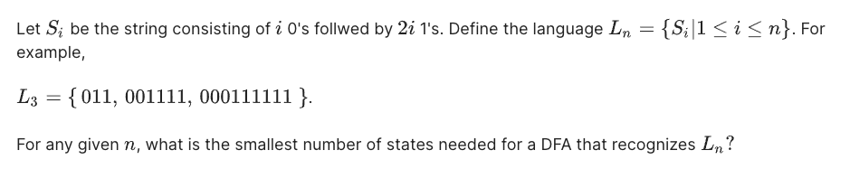

# 2. Lexical Analysis
##### Angold Wang 19/02/2022


#### User view
```c
if (i == j) 
    z = 0;
else 
    z = 1;
```

#### Compiler view
```
if (i == j)\n\t\tz = 0;\n\telse\n\t\tz = 1;
```

## 1. Formal Languages

### Seperate Syntax and Semantics
* Makes clear what is syntax, what is semantics.
* Example: **Roman numerals vs. Arabic numerals**
    * Roman numerals are painful to do addition and subtraction, etc.
    * The reason is that the algorithms were kind of complicated.
    * The notation causes this big difference (procedure)
    * Don't underestimate the importatance of notation.

### Syntax vs. Semantics
* We can use **Multiple syntax** to represent the **same semantics.**
* Which is the basis of **Optimization.**
* The fact that several programs that are actually functionally equivalent, that allow us to substitute one program that runs faster than another.
* **Never one to many!!!**

## 2. Lexical Specification
#### 1. Write rexp for the lexemes of each token class
* Number = digit+
* Keyword = 'if' + 'else' + 'for' + ...
* Identifier = letter(letter + digit)\*
* OpenPar = '('
* ...

#### 2. Construct R, matching all lexemes for all tokens
**Which is just the union of all the regular expressions**<br>
**`R = Keyword + Identifier + Number + ...`**<br>
**R is the some of of all the different token classes of our language**

#### 3. Let input be `x1...xn`
**For `1 <= i <= n` check whether `x1...xi` in `L(R)`**.<br>

**What if no rules matches?**
* **if the whole `x1...xn` not in L(R)** - We don't let this ever happen.
* **We we are going to do instead, is to write a category of error strings.**
    * **`ERROR = all strings not in the lexical specifications`**
    * Put **`ERROR`** last in piority

#### 4. If success, then we know that
**`x1...xi` in `L(Rj)` for some j**

**How much input is used?**
* **if `x1...xi` in `L(R)`, and so as `x1...xj` `(i != j)`**
    * For example. **`==` should be treat as "double `=`" or "equal operator `==`"?**
* Solution: **Maximal Munch**
    * We should always take the longer one when meet ambigurity
    * That just the way that humans themselves read things


**Which token is used?**
* **Suppose `R = R1 + R2 + ... Rn` and there we have:**
    * `(x1...xi)` in `L(Rj)`
    * `(x1...xi)` in `L(Rk)`
    * `k != j`
* For example. **`if` should be treat as an Identifier or a keyword?**
* Solution: **Piority Ordering**
    * Choose the one listed first. 
    * typically, put **keywords** before the **identifiers**


#### 5. Remove `x1...xi` from input and go to (3)

## 3. Finite Automata
* **Regular expressions = specification**
* **Finite automata = implementation**



* **Both NFAs and DFAs can recognize regular languages (equivalent power)**
* **DFAs are faster to execute.**
    * There are no choices to consider
* **NFAs are, in general, smaller.**


**Example: A NFA that accepts the rexp: `1* + 0`**:


### 1. Regular Expressions -> NFA


### 2. NFA to DFA

* Key IDEA: **DFA M' keeps track of the subset of possible states in NFA M.**
* That is why in general DFA are much bigger: **`2^n - 1` subsets for n states NFA**


### 3. Implement Table-driven DFA

## 3. Exercises

### 1. Minimum States


* **Answer: Minimum states: 3n + 1**


### 2. NFA vs. DFA
**Question: Which of the following automata are NFAs?**


* **NFAs must have a finite set of states, which rules out the last option.**
* **Every DFA is also an NFA, which is why the first option is included.**


