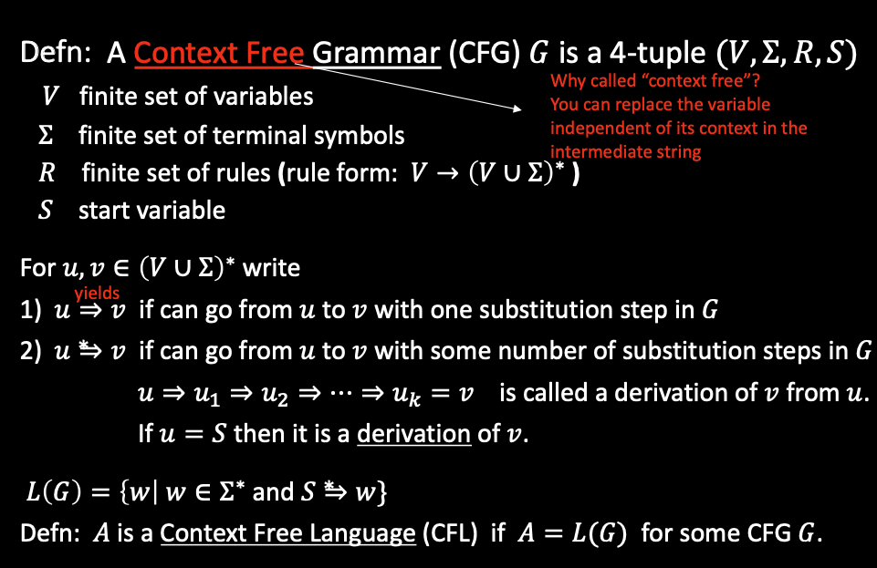
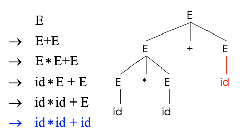
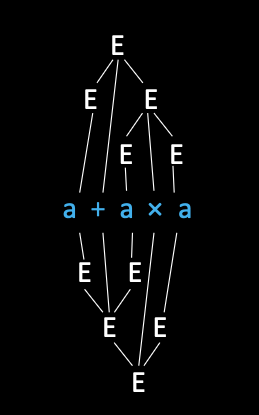

# 3. Parsing

## 1. Context-free Grammars

### i. The limitation of Regular Languages
* **The weakest formal languages that widely used.**
* **Finite automaton cannot remember # of times it has visited a particular state.**
* **There are a lot of languages that are non-regular** (Using pumping lemma)
    * i.e. Strings of balanced parentheses are not regular


### ii. Context-free Grammars
#### Why do we need CFG?
**There are a lot of things that Lexical Analysis cannot do, through there are also some complicated things that they can do.**

Not all strings of tokens are programs, the parser must distinguish between valid and invalid strings of tokens.

| Phase | Input | Output |
| ----- | ----- | ------ |
| Lexer | String of characters | string of tokens |
| Parser | String of tokens | Parse tree |

* **The parser need to figure out the meaning of the input tokens, and the meaning is embedded within the structure of the parse tree**

#### Terminals
* **Programming language constructs have recursive structure**.
```
EXPR:
if EXPR then EXPR else EXPR fi
while EXPR loop EXPR pool
```
* **The tokens (cannot be replaced recursively) is called terminal**
* **The grammar's language is going to be a language over strings whose alphabet are the terminal symbols.**


#### Definition of CFG



**Context-free Grammars generate strings:**
1. Write down start variable
2. Replace any variable accorting to a rule, **Repeat until only terminals remain.**
3. Result is the generated string, and **we've generated a string that is in the language of the grammar.**
4. **`L(G)`** is the language of **all** generated strings.
5. We call **`L(G)`** a Context Free language.


## 2. Parse Tree

The idea of CFG is a big step, but the CFG can only tell us whether a sequence of token are in or not in the language. Despite this, we are also intersted in the derivation process, which can be described as a **Parse Tree**.



### i. Ambiguity

**A Context-free Grammar is ambiguous if it has more than one parse tree for some string.**


