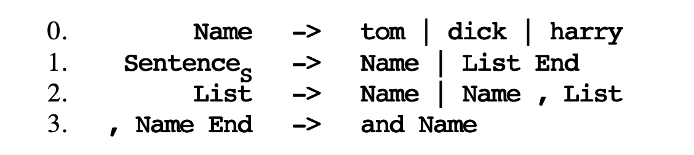
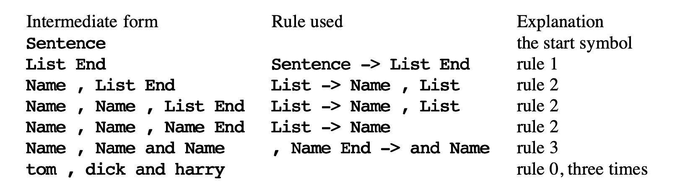
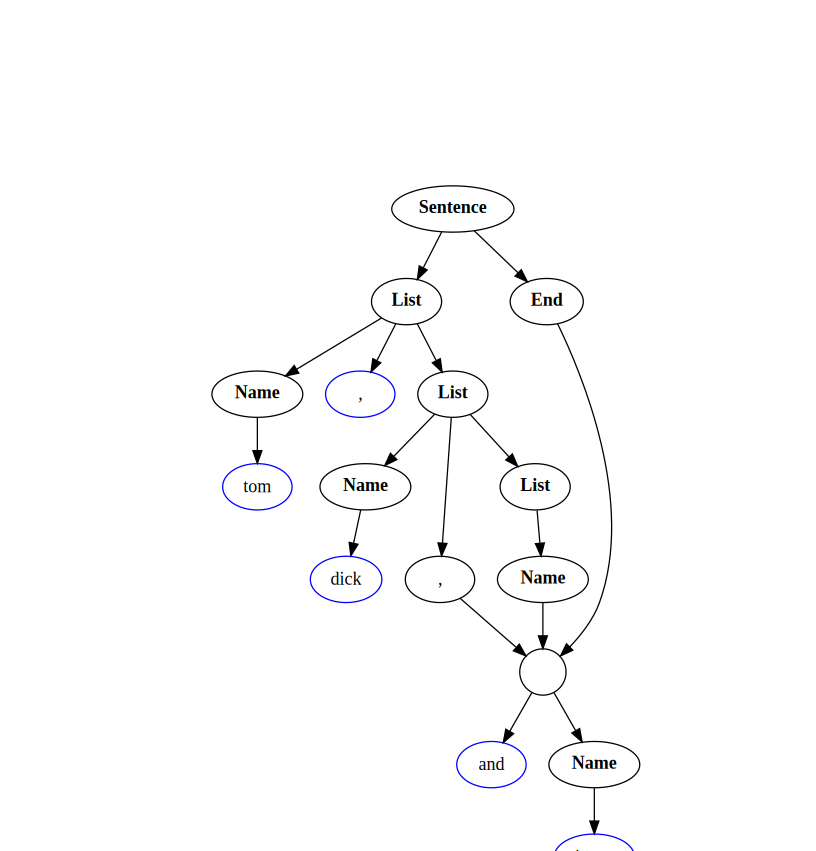

### Parsing Techniques Notes by Angold Wang

# 1. Parsing and Grammars 

Include Chapter 1 & 2 of the book: **[Parsing Techniques](ParsingTechniques.pdf)**.

**Parsing (syntactic analysis) is probably one of the best understood branches of computer science.** And of course parsers are being used extensively in a number of disciplines:

### In Computer Science
* **Compiler Construction**
* **Database Interfaces**
* **Artificial Intelligence**
* ...

### In Linguistics
* **Text and Textual Analysis**
* **Natual language Translation and Recongnition**
* **Corpora Analysis**
* ...

In this series: **[Parsing Techniques Notes](https://angold4.org/cs/)**, I'm trying to illustrate the basic concepts, and techniques of **Parsing**, which are the notes of the book: **[Parsing Techniques](ParsingTechniques.pdf)** by **Dick Grune** and **Ceriel Jacobs**.

## 1. An Overview of Parsing
**"Parsing is the process of structuring a linear representation in accordance with a given grammar"**.

If you do not know what parsing is, here is the definition. But you may still confuse with that after reading it. Since this definition has been kept abstract on purpose, to allow as wide an interpretation as possible.

### i. The Target of Parsing

The **"linear representation"** that shown in the definition may be a sentence, a computer program, a knitting pattern, a sequence of geological strata, or even a piece of music. and they do have something in common: 

1. Any linear representation (sequence) has some **rule** with it, which tells the parser whether it is an valid sequence, and tells us the meaning of the representation. We call that rule **grammar**.

2. Any linear representation (sequence) in which the **preceding elements in some way restrict the next element**.
    * For example: Consider a simple calculator "**`1 + 2 =`**": if the preciciding element in that expression is a number, say `3`, **it will restrict its next element so that it can only be a symbol (e,g. `+`)**.
    * If there is no restriction, the sequence still has a grammar, but this grammar is trivial, uninformative and hard to understand.

### ii. The Purpose of Parsing

For each grammar, there are generally an infinite number of linear representations (aka "sentence") that can be structured with it. **The finite-size grammar can supply structure to an infinite number of sentences.** And that is the purpose of a grammar: **To Summarize succinctly the structure of an infinite number of objects of a certain class."**

In general, there are two reasons to perform this structuring process called parsing:

1. **After parsing a given sentence, we can show that whether this sentence can be recongnized according to a grammar.** And for the error-repairing parsers, they can suggest possible word classes for missing or unknown words on clay tablets.

2. **Grammars usually have semantics attached to them** (Specific sementics is attached to specific rules); **The obtained structure (e.g. parse tree) of parsing can help us to process the sentence fucther. (understand its semantics)**
    * The obtained structure often shows which rules were involved in the production of a string and how.
    * Reconginition is not enough, we need parsing to get the full benefit of the syntactic approach.

## 2. Grammars as a Generating Device

Everyone who has studied a foreign language knows that a grammar is a book of rules and examples which describes and teaches the language. The computer scientist takes a very abstracted view of it, which not only can grammar describe a language, **but also it should show the recipe of that language (the recipe should imply how a sentence can be constructed).**

Quite unlike human, the computer needs a **clear, well-understood and unambiguous grammar** in order to process its language. In the human's world, the linguist holds his view of language because it gives him a formal tight grip on a seemingly chaotic and perhaps infinitely complex object: **natual language**, and understand its meaning through the human's heart.

### i. Describing a language through a finite recipe.

**A good way to build a set of objects is to start with a small object and to give rules how to add to it and construct new objects from it.** For example, "Two is an even number and the sum of two even numbers is again an even number" effectively generates the set of all even numbers. 

Suppose we want to generate the set of all enumerations of names, of the type "Tom, Dick and Harry", in which all names but the last two are separated by commas.

For example, in this case, we will not accept "Tom, Dick, Harry" nor "Tom and Dick and Harry". And Only "Tom, Dick and Harry" would be right. **A simple-minded recipe would be:**

#### Recipe #1
0. Tom is a name, Dick is a name, Harry is a name;
1. a name is a sentence;
2. a sentence followed by a comma and a name is again a sentence; 
3. before finishing, if the sentence ends in ", name", replace it by "and name".

**Although this seems will work for a cooperative reader, there are several things wrong with it:**

#### Problems of Recipe #1
1. **In Clause 3, the sentence does not really end in ", name", it actually end in ", Dick" or such.**
    * The "name" is just a symbol that stands for the real name. it will be replaced by a real name as given in rule 1.
    * **To Solve it, we define that there are two kinds of symbols involved here: terminals and non-terminals**.
    * **terminals** (short for "terminal symbols") are symbols that will occur in finished sentences. (e.g, "tom")
    * **non-terminals** (a singularly unin-spired term) which are the intermediate symbols that cannot occured in a finished sentence.

2. **As I mentioned above, the computer needs a clear and generative grammar in order to process its language.** 
    * In Clause 1, the "$X$ is a $Y$" should be replaced by "$Y$ may be replaced by $X$".

**This gives us the Recipe #2:** 

(To distinguish them, we write terminals in small letters and start non-terminals with a bond capital.)

#### Recipe #2
0. **Name** may be replaced by "tom" | **Name** may be replaced by "dick" | **Name** may be replaced by "harry"
1. **Sentence** may be replaced by **Name**
2. **Sentence** may be replaced by **Sentence, Name**
3. **", Name"** at the end of a **Sentence** must be replaced by **"and Name"** before **Name** is replaced by any of its replacements
4. a sentence is finished only when it no longer contains non-terminals
5. we start our replacement procedure with **Sentence**

Clause 1 through 4 describe replacements, Clause 5 is not specific to this grammar. It is valid generally and is one of the rules of the game. Clause 6 tells us where to start generating.

#### Problem of Recipe #2

The Only problem of recipe #2 is also in Clause 4: most rules have "may be replaced", but this one has "must be replaced". And since we want a more generic and elegant grammar, we only want to use **may be replaced** in all of our rules.

This can be solved by adding an **end-marker** after it. And if we make the **end-marker** a **non-terminal** which cannot be used anywhere except in the required replacement from ", Name" to "and Name", we automatically **enforce the restriction that no sentence is finished unless the replacement test has taken place.**

Then for brevity we write $\to$ instead of "may be replaced by" and here comes the final recipe #3:

#### Recipe #3
0. **Name** $\to$ tom | **Name** $\to$ dick | **Name** $\to$ harry
1. **Sentence** $\to$ **Name** | **Sentence** $\to$ **List** End
2. **List** $\to$ Name | **List** $\to$ **List, Name**
3. **, Name End** $\to$ and **Name**
4. the start symbol is **Sentence**

As we can see, **we have succeeded in implementing the notion "must replace" in a system that only uses "may replace"; looking more closely, we see that we have split "must replace" into "may replace" and "must not be a non-terminal".**

The above recipe form #3, based on replacement according to rules, is strong enough to serve as a basis for **formal grammars.**

### ii. Formal Grammars

Here, based on Recipe #3, we will give a formal definition of grammars, but before that, let me introduce the two reasons for having a **formal definition**:

1. **It allows us to be very precise**, then we'll know exactly what we means by a **grammar** and should answer any question about what counts and what doesn't count.
2. We can use this **formal notation** rather than as a kind of a picture when we want to represents them in formal articles.

#### The definition of formal grammars

**A** *generative grammar* **is a 4-tuple $(V_N, V_T, R, S)$ such that:**
1. **$V_N$ and $V_T$ are finite sets of symbols.**
2. **$V_N \cap V_T = \varnothing$**
3. **$R$ is a set of pairs $(P, Q)$ such that:**
    * $P \in (V_N \cup V_T)^+$
    * $Q \in (V_N \cup V_T)^*$
4. **$S \in V_N$**

A 4-tuple is just an object consisting of 4 identifiable parts; they are the **non-terminals**, **the terminals**, the **rules** and the **start symbol**, in that order. For our grammars we have:

$$
V_N = {\mathbf Name, \mathbf Sentence, \mathbf List, \mathbf End}
$$

$$
V_T = {tom, dick, harry, \mathbf, , and}
$$

The intersection of $V_N$ and $V_T$ (2) must be empty, that is, the non-terminals and the terminals may not have a symbol in common, which is understandable.

$R$ is the set of all rules (3), and $P$ and $Q$ are the left-hand sides and right-hand sides, respectively. Each $P$ must consist of sequences of **one or more non-terminals and terminals** and each $Q$ must consist of sequences of **zero or more non-terminals and terminals**.

The start symbol $S$ must be an element of $V_N$, that is, it must be a non-terminal:

$$
S = \mathbf Sentence
$$

#### Generating sentences from a formal grammar

Now, let's using our formal grammar to generate some sentences. For your convinence, I'll put the [Recipe #3](https://angold4.org/cs/docs/parsingtech/1Introduction.html#Recipe-#3) here, with some little changes:
1. Several right-hand sides for one and the same left-hand side are **grouped together** and separated by vertical bars.
2. The non-terminal with the subscript $_s$ is the start symbol.

Now let's generate our initial example from this grammar, using replacement according to the above rules only. We obtain the following successive forms for **Sentence**:

The intermediate forms are called *sentential forms*; **if a sentential form contains no non-terminals it is called a sentence and belongs to the generated language**. The transitions from one line to the next are called production steps and the rules are often called production rules.

This production process can be made more visual by drawing connective lines between corresponding symbols, such a picture is called *production graph* or *syntactic graph*, because **it depicts the syntactic structure (with regard to the given grammar) of the finial sentence**

## 3. The Chomsky Hierarchy of Grammars

The **Formal Grammars** was first studied extensively by **[Noam Chomsky](https://en.wikipedia.org/wiki/Noam_Chomsky)** in 1959. His analysis has been the foundation for almost all research and progress in formal languages, parsers and a considerable part of compiler construction and linguistics.

