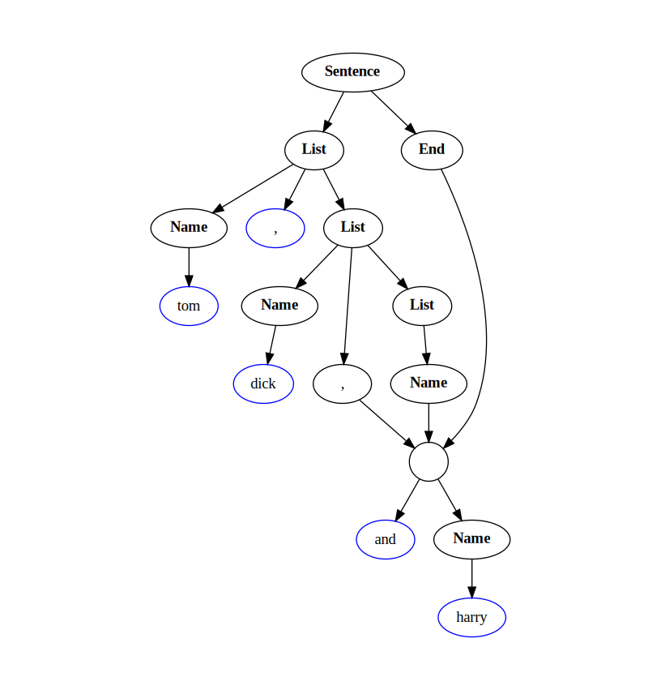

### Parsing Techniques Notes by Angold Wang

# 1. Parsing and Grammars 

Include Chapter 1 & 2 of the book: **[Parsing Techniques](ParsingTechniques.pdf)**.

**Parsing (syntactic analysis) is probably one of the best understood branches of computer science.** And of course parsers are being used extensively in a number of disciplines:

### In Computer Science
* **Compiler Construction**
* **Database Interfaces**
* **Artificial Intelligence**
* ...

### In Linguistics
* **Text and Textual Analysis**
* **Natual language Translation and Recongnition**
* **Corpora Analysis**
* ...

In this series: **[Parsing Techniques Notes](https://angold4.org/cs/)**, I'm trying to illustrate the basic concepts, and techniques of **Parsing**, which are the notes of the book: **[Parsing Techniques](ParsingTechniques.pdf)** by **Dick Grune** and **Ceriel Jacobs**.

## 1. An Overview of Parsing
**"Parsing is the process of structuring a linear representation in accordance with a given grammar"**.

If you do not know what parsing is, here is the definition. But you may still confuse with that after reading it. Since this definition has been kept abstract on purpose, to allow as wide an interpretation as possible.

### i. The Target of Parsing

The **"linear representation"** that shown in the definition may be a sentence, a computer program, a knitting pattern, a sequence of geological strata, or even a piece of music. and they do have something in common: 

1. Any linear representation (sequence) has some **rule** with it, which tells the parser whether it is an valid sequence, and tells us the meaning of the representation. We call that rule **grammar**.

2. Any linear representation (sequence) in which the **preceding elements in some way restrict the next element**.
    * For example: Consider a simple calculator "**`1 + 2 =`**": if the preciciding element in that expression is a number, say `3`, **it will restrict its next element so that it can only be a symbol (e,g. `+`)**.
    * If there is no restriction, the sequence still has a grammar, but this grammar is trivial, uninformative and hard to understand.

### ii. The Purpose of Parsing

For each grammar, there are generally an infinite number of linear representations (aka "sentence") that can be structured with it. **The finite-size grammar can supply structure to an infinite number of sentences.** And that is the purpose of a grammar: **To Summarize succinctly the structure of an infinite number of objects of a certain class."**

In general, there are two reasons to perform this structuring process called parsing:

1. **After parsing a given sentence, we can show that whether this sentence can be recongnized according to a grammar.** And for the error-repairing parsers, they can suggest possible word classes for missing or unknown words on clay tablets.

2. **Grammars usually have semantics attached to them** (Specific sementics is attached to specific rules); **The obtained structure (e.g. parse tree) of parsing can help us to process the sentence fucther. (understand its semantics)**
    * The obtained structure often shows which rules were involved in the production of a string and how.
    * Reconginition is not enough, we need parsing to get the full benefit of the syntactic approach.

## 2. Grammars as a Generating Device

Everyone who has studied a foreign language knows that a grammar is a book of rules and examples which describes and teaches the language. The computer scientist takes a very abstracted view of it, which not only can grammar describe a language, **but also it should show the recipe of that language (the recipe should imply how a sentence can be constructed).**

Quite unlike human, the computer needs a **clear, well-understood and unambiguous grammar** in order to process its language. In the human's world, the linguist holds his view of language because it gives him a formal tight grip on a seemingly chaotic and perhaps infinitely complex object: **natual language**, and understand its meaning through the human's heart.

### i. Describing a language through a finite recipe.

**A good way to build a set of objects is to start with a small object and to give rules how to add to it and construct new objects from it.** For example, "Two is an even number and the sum of two even numbers is again an even number" effectively generates the set of all even numbers. 

Suppose we want to generate the set of all enumerations of names, of the type "Tom, Dick and Harry", in which all names but the last two are separated by commas.

For example, in this case, we will not accept "Tom, Dick, Harry" nor "Tom and Dick and Harry". And Only "Tom, Dick and Harry" would be right. **A simple-minded recipe would be:**

#### Recipe #1
1. Tom is a name, Dick is a name, Harry is a name;
2. a name is a sentence;
3. a sentence followed by a comma and a name is again a sentence; 
4. before finishing, if the sentence ends in ", name", replace it by "and name".

**Although this seems will work for a cooperative reader, there are several things wrong with it:**

#### Problems of Recipe #1
1. **In Clause 3, the sentence does not really end in ", name", it actually end in ", Dick" or such.**
    * The "name" is just a symbol that stands for the real name. it will be replaced by a real name as given in rule 1.
    * **To Solve it, we define that there are two kinds of symbols involved here: terminals and non-terminals**.
    * **terminals** (short for "terminal symbols") are symbols that will occur in finished sentences. (e.g, "tom")
    * **non-terminals** (a singularly unin-spired term) which are the intermediate symbols that cannot occured in a finished sentence.

2. **As I mentioned above, the computer needs a clear and generative grammar in order to process its language.** 
    * In Clause 1, the "$X$ is a $Y$" should be replaced by "$Y$ may be replaced by $X$".

**This gives us the Recipe #2:** 

(To distinguish them, we write terminals in small letters and start non-terminals with a bond capital.)

#### Recipe #2
1. **Name** may be replaced by "tom" | **Name** may be replaced by "dick" | **Name** may be replaced by "harry"
2. **Sentence** may be replaced by **Name**
3. **Sentence** may be replaced by **Sentence, Name**
4. **", Name"** at the end of a **Sentence** must be replaced by **"and Name"** before **Name** is replaced by any of its replacements
5. a sentence is finished only when it no longer contains non-terminals
6. we start our replacement procedure with **Sentence**

Clause 1 through 4 describe replacements, Clause 5 is not specific to this grammar. It is valid generally and is one of the rules of the game. Clause 7 tells us where to start generating.

#### Problem of Recipe #2

The Only problem of recipe #2 is also in Clause 4: most rules have "may be replaced", but this one has "must be replaced". And since we want a more generic and elegant grammar, we only want to use **may be replaced** in all of our rules.

This can be solved by adding an **end-marker** after it. And if we make the **end-marker** a **non-terminal** which cannot be used anywhere except in the required replacement from ", Name" to "and Name", we automatically **enforce the restriction that no sentence is finished unless the replacement test has taken place.**

Then for brevity we write $\to$ instead of "may be replaced by" and here comes the final recipe #3:

#### Recipe #3
1. **Name** $\to$ tom | **Name** $\to$ dick | **Name** $\to$ harry
2. **Sentence** $\to$ **Name** | **Sentence** $\to$ **List** End
3. **List** $\to$ Name | **List** $\to$ **List, Name**
4. **, Name End** $\to$ and **Name**
5. the start symbol is **Sentence**

As we can see, **we have succeeded in implementing the notion "must replace" in a system that only uses "may replace"; looking more closely, we see that we have split "must replace" into "may replace" and "must not be a non-terminal".**

The above recipe form #3, based on replacement according to rules, is strong enough to serve as a basis for **formal grammars.**

### ii. Formal Grammars

Here, based on Recipe #3, we will give a formal definition of grammars, but before that, let me introduce the two reasons for having a **formal definition**:

1. **It allows us to be very precise**, then we'll know exactly what we means by a **grammar** and should answer any question about what counts and what doesn't count.
2. We can use this **formal notation** rather than as a kind of a picture when we want to represents them in formal articles.

#### The definition of formal grammars

**A** *generative grammar* **is a 4-tuple $(V_N, V_T, R, S)$ such that:**

1. **$V_N$ and $V_T$ are finite sets of symbols.**
2. **$V_N \cap V_T = \varnothing$**
3. **$R$ is a set of pairs $(P, Q)$ such that:**

    * $P \in (V_N \cup V_T)^+$

    * $Q \in (V_N \cup V_T)^*$
4. **$S \in V_N$**

A 4-tuple is just an object consisting of 4 identifiable parts; they are the **non-terminals**, **the terminals**, the **rules** and the **start symbol**, in that order. For our grammars we have:

$$
V_N = {\mathbf Name, \mathbf Sentence, \mathbf List, \mathbf End}
$$

$$
V_T = {tom, dick, harry, \mathbf, , and}
$$

The intersection of $V_N$ and $V_T$ (2) must be empty, that is, the non-terminals and the terminals may not have a symbol in common, which is understandable.

$R$ is the set of all rules (3), and $P$ and $Q$ are the left-hand sides and right-hand sides, respectively. Each $P$ must consist of sequences of **one or more non-terminals and terminals** and each $Q$ must consist of sequences of **zero or more non-terminals and terminals**.

The start symbol $S$ must be an element of $V_N$, that is, it must be a non-terminal:

$$
S = \mathbf Sentence
$$

#### Generating sentences from a formal grammar

Now, let's using our formal grammar to generate some sentences. For your convinence, I'll put the [Recipe #3](https://angold4.org/cs/docs/parsingtech/1Introduction.html#Recipe-#3) here, with some little changes:
1. Several right-hand sides for one and the same left-hand side are **grouped together** and separated by vertical bars.
2. The non-terminal with the subscript $_s$ is the start symbol.

Now let's generate our initial example from this grammar, using replacement according to the above rules only. We obtain the following successive forms for **Sentence**:

The intermediate forms are called *sentential forms*; **if a sentential form contains no non-terminals it is called a sentence and belongs to the generated language**. The transitions from one line to the next are called production steps and the rules are often called production rules.

This production process can be made more visual by drawing connective lines between corresponding symbols, such a picture is called *production graph* or *syntactic graph*, because **it depicts the syntactic structure (with regard to the given grammar) of the finial sentence**

## 3. The Chomsky Hierarchy of Grammars

The example above shows us indeed **some simple phrase structure grammars can actually generate very complicated sets**. Moreover, by giving the definition of **formal grammars** (e.g. instantiate the grammar), we can now try to deal with our problem -- **How to parsing**.

The **Formal Grammars** was first studied extensively by **[Noam Chomsky](https://en.wikipedia.org/wiki/Noam_Chomsky)** in 1959. His analysis has been the foundation for almost all research and progress in formal languages, parsers and a considerable part of compiler construction and linguistics.

> According to Chomsky's hypothesis, the reason why humans can speak is that humans are born with a dedicated circuit for acquiring production rules in the brain. Because humans have the ability to acquire **recursive language rules**, they become able to speak languages. Non-human animals do not have the ability to acquire language, which he attributed to the absence of circuits in the non-human brains for acquiring production rules. Chomsky's claims, which have not been substantiated or disproved nearly 60 years after the hypothesis was published, are still considered quite convincing.

In practice, the grammar can be so complex, **we shall see that now general parsing algorithm for them can exist, and all known special parsing algorithms are either very inefficient or very complex.** The desire to **restrict the unmanageability of phrase structure grammars,** while keeping as much of their generative powers as possible, has led the *Chomsky hierarchy of grammars*. 

This hierarchy distinguishes four types of grammars numbered from 0 to 3. Type 0 grammars are the (unrestricted phrase structure grammars of which we have already seen examples). The other types originate from **applying more and more restrictions** to the allowed form of the rules in the grammar, by applying these restrictions:

* The resulting grammars are gradually easier to understand and to manipulate.
* But their **generative power** are gradually less powerful.

Fortunately, these less powerful types are still very useful, actually more useful even than Type 0. We shall now introduce each of the three remaining types in turn:

### Type 1 grammars

#### Definition:
* **Definition 1: A grammar is** *Type 1 monotonic* **if it contains no rules in which the left hand side consists of more symbols than the right hand side.**
    * Example: **$,$  $Name$  $End$ $\to$ $and$ $Name$** is prohibited in type 1.

* **Definition 2: A grammar is** *Type 1 context-sensitive* **if all of its rules are context-sensitive.**
    * Context-sensitive: **Only one (non-terminal) symbol in its left-hand side gets replaced by other symbols**.

We can prove that: **Monotonic and context-sensitive grammars are equally powerful.** They all classified as Type 1 grammars, and both of them are less powerful than the Type 0 grammars, that is, there are languages that can be generated by a Type 0 grammar but now by any Type 1.

#### Example:

The standard example of a Type 1 language is the set of words that consist of equal numbers of a's, b's and c's:
$$
a^n  b^n  c^n
$$

Since usually it is not that easy to give a grammar of Type 1 language by human. For the sake of completeness, I just put the correct grammar here, with a derivation tree for $a^2b^2c^2$ as an example to show the derivation process.

You may find that although Type 1 grammars (also called as context-sensitive grammars) can express correlations, but the grammar is not in a way that human can understand.

### Type 2 grammars

#### Definition:
* **Definition: A grammar is** *Type 2 context-free grammars* **if all of its rules are context-free.**
    * Context-free: **Only single non-ternminal are allowed on the left-hand side.**

Comparing to the Type 1 (CS) grammar, the Type2 (CF) grammer have the following properties:

1. Since there is always only one symbol on the left-hand side, each node in a production graph has the property that whatever it produces is independent of what is neighbours produce: **The productive life of a non-terminal is independent of its context.** (That is why it is called context-free). Unlike context-sensitive grammars, which has to look at its neighbours on the left and on the right to see what production rules are allowed for it.

2. The production graph will consequently has a pure tree-form called a *production tree*.

3. Since there is only one symbol on the left-hand side, all right-hand sides for a given non-terminal; can always be collected in one grammar rule, and then each grammar reads like a **definition** of the left-hand side.

#### Examples:

The standard example of a Type 2 language is also equal numbers of words, but only for 2 different words.

$$
a^n  b^n
$$

And the CF grammar is pretty easy, which is human-understandable.

$$
S \to a S b  \vert  ab
$$

#### The limitations of CF grammars:

When one has been working for a while with CF grammars, one gradually gets the feeling that almost anything could be expressed in a CF grammar. However, serious limitations to what can be said by a CF grammar is shown by the famous *uvwxy* theorem (also called **pumping lemma**). And by using this lemma, we can easily prove that whether a language can be expressed using a CF grammar.

#### Pumping Lemma for CFLs:
**For every CFL $A$, there is a $p$ such that if $s$ $\in$ $A$ and $|s|$ $\ge$ $p$ then $s$ $=$ $uvxyz$ where:**

1. $uv^ixy^iz \in A$ for all $i \ge 0$.

2. $vy \neq \epsilon$

3. $|vxy| \le p$

**Any sentence generated by a CF grammar, that is longer than the longest original sentence from that grammar, can be cut into five pieces $u,v,w,x$ and $y$ in such a way that $uv^nwx^ny$ is a sentence from that grammar for all $n \ge 0$**

All long unoriginal string s that CF generates have this **pumping quality**:

**You can break them up into five pieces, so that the second and forth piece can be repeated and stay in the language.**

### Type 3 grammars

#### Definition:
* **Definition: A grammar is** *Type 3 regular grammars* **if all of its rules are regular.**
    * Regular #1: **A non-terminal produces zero or more terminals.**
    * Regular #2: **A non-terminal produces zero or more terminals followed by one non-terminal.**

Type 3 grammars are also called *regular grammars* or *finite-state* grammars. Since regular grammars are used very often to describe the structure of text on the character level. (e.g. **classification of different tokens**)

### Type 4 grammars

The last restriction we shall apply to what is allowed in a production rule is a pretty final one: **no non-terminal is allowed in the right-hand side.** This removes all the generative power from the mechanism, except for the choosing of alternatives, which will only introduce a finite number of terminals.

The type 4 grammar is also called finite-choice grammar. And it can only be used in some limited situations (e.g. **classification of different chars**).

### A comparision of grammar types

This differece between these grammars has been depicted metaphorically in the rose figure above, in which a rose is approximated by increasingly finer outlines. In this metaphor, the **rose corresponds to the language** (imagine the sentences of the language as molecules in the rose); **the grammar serves to delineate its silhouette.** 

* A **regular grammar** only allows us straight horizontal and vertical line segments to describe the flower; ruler and T-square suffice, but the result is a coarse and mechanical-looking picture. 
* A **CF grammar** would approximate the outline by straight lines at any angle and by circle segments; the drawing could still be made using the classical tools of compasses and ruler. The result is stilted but recognizable. 
* A **CS grammar** would present us with a smooth curve tightly enveloping the flower, but the curve is too smooth: it cannot follow all the sharp turns and it deviates slightly at complicated points; still, a very realistic picture results. 
* An **unrestricted phrase structure grammar** can represent the outline perfectly. The rose itself cannot be caught in a finite description; its essence remains forever out of our reach.

A more prosaic and practical example can be found in the successive sets of **Pascal** programs that can be generated by the various grammar types. 

* **The set of all lexically correct Pascal programs can be generated by a regular grammar.**
  * A Pascal program is lexically correct if there are no newlines insidstrings, comment is terminated before end-of-file, all numerical constants have the right form, etc.

* **The set of all syntactically correct Pascal programs can be generated by a context-free grammar.**

* **The set of all semantically correct Pascal programs can be generated by a CS grammar** 
  * A Pascal programs is semantically correct if it will pass through a Pascal compiler without drawing error messages.

* **The set of all Pascal programs that would terminate in finite time when run with a given input can be generated by an unrestricted phrase structure grammar.**

* **The set of all Pascal programs that solve a given problem** (for instance, play chess) cannot be generated by a grammar (although the description of the set is finite).

