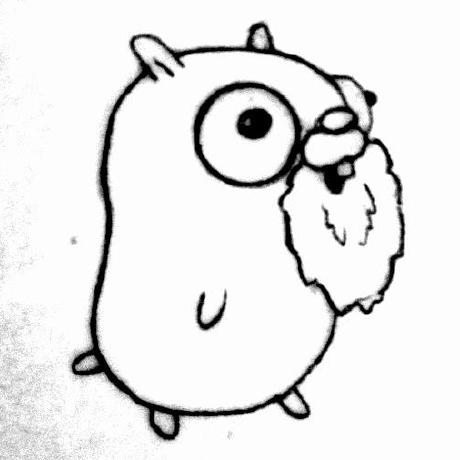

## An introduction to creating a C compiler - weicc

# 1. Thompson 1984



## 1. Reflections on Trusting Trust

To begin with, I want to introduce this old but not outdated famous speech by **[ken Thompson](https://en.wikipedia.org/wiki/Ken_Thompson)** when he won the **Turing Award** in 1984. Namely **"[Reflections on Trusting Trust](../../uc/thompson1984.pdf)"**.

In this speech, thompson mentioned a lot of special topics, including program saftey, compiler... And I want to just introduce the first part of this speech (related to the compiler), which seems shows the solution of some intersting but non-obvious problems. If you feel interested in these topic, I highly recommend you to read the [original pdf](../../uc/thompson1984.pdf).

### Intro Stage: How do we know a program is safe?
* **Inspect the program's source code**

* But isn't the program source code compiled by a compiler?
    * **Then we inspect the compiler's source code.**

* But is't the compiler compiled by another compiler?
    * **Self-hostng compilers compile themselves.**
    * e.g, gcc compiles gcc

* ......

### Stage i - A program that produces itself (quines)

> **Problem: Write a source program that, when compiled and executed, will produce as output an exact copy of its source. (Thompson)**

There are a couple of different strategies to writing quines. The obvious one is to just write code that opens the code file and prints it out. But the more interesting ones involve language features that allow for self-embedding (using variables) and a lot of trial and error is involved.

**[quine.c](../../uc/stages/quines.c)** is one of the implementation, I found it very intersting while implementing it that **if you take care of the variables inside the program, you may implement your own version very easy (careful enough). However, if you try to use no variables (`TEXT`) in `quine.c` it seems impossible to implement quine.**

For example, first, whatever the program looks like, at some point it has to print something: 
```
print ...
```
However, what should it print? itself, so it needs to print the "print" command:
```
print "print ..."
```
What should it print next? Well, in the mean time the program grew, so it needs to print the string starting with "print" too!
```
print "print \"print ... \""
```
**..... It seems that we are dropping into an "endless rabbit hole": The string `"print \""` is repeated over and over again.** And it would be nice to put the repeating part into a variable:

```
a = "a = @\nprint a.replace(\"@\", quoted(a))"
print a.replace("@", quoted(a))
```
**Which solves this problem perfectly and precisely !**

#### What can we get from this "technique"?

### Stage ii - An example of ccc (Compiler that Compilers a Compiler)


## 2. Meet weicc


## 3. Taste: A Simple "add and subtract" Compiler


## References
1. **[Reflections on Trusting Trust, 1984, Thompson](../../docs/weicc/thompson1984.pdf)**
2. **[VCF East 2019 -- Brian Kernighan interviews Ken Thompson](https://www.youtube.com/watch?v=tc4ROCJYbm0)**
3. **[AT&T Archives: The UNIX Operating System](https://www.youtube.com/watch?v=EY6q5dv_B-o)**
4. **[Ken Thompson and Dennis Ritchie Explain UNIX (Bell Labs)](https://www.youtube.com/watch?v=JoVQTPbD6UY)**
5. **[2011 (27th) Japan Prize; Dr. Ritchie / Dr. Thompson](https://www.youtube.com/watch?v=IjvjqAVkvYo)**
6. **[低レイヤを知りたい人のためのCコンパイラ作成入門 by Rui Ueyama](https://www.sigbus.info/compilerbook)**
