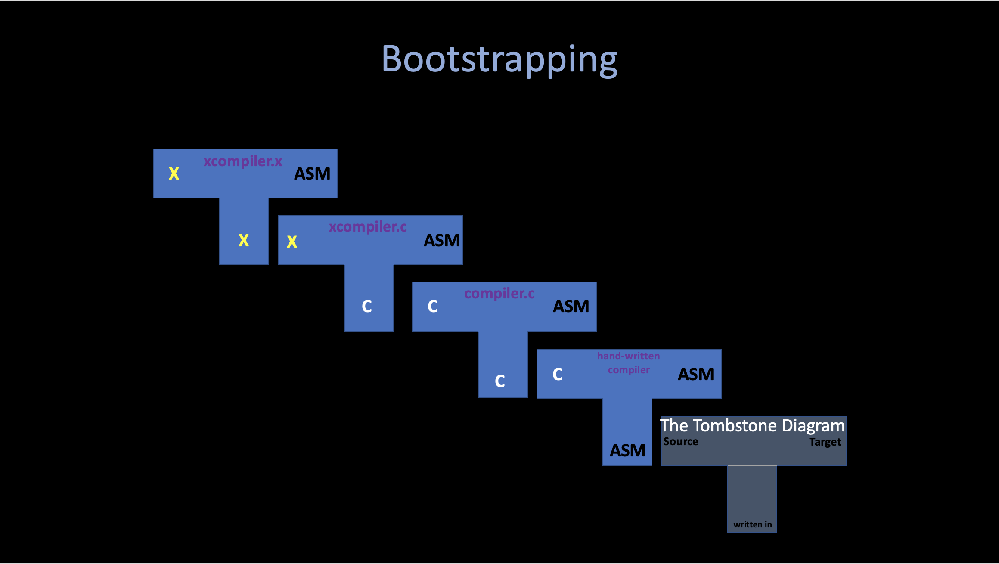

## An introduction to creating a C compiler - weicc

# 1. Thompson 1984


## 1. Reflections on Trusting Trust

To begin with, I want to introduce this old but not outdated famous speech by **[ken Thompson](https://en.wikipedia.org/wiki/Ken_Thompson)** when he won the **Turing Award** in 1984. Namely **"[Reflections on Trusting Trust](../../uc/thompson1984.pdf)"**.

In this speech, thompson mentioned a lot of special topics, including program saftey, compiler... And I want to just introduce the first part of this speech (related to the compiler), which seems shows the solution of some intersting but non-obvious problems. If you feel interested in these topic, I highly recommend you to read the [original pdf](../../uc/thompson1984.pdf).

### Intro Stage: How do we know a program is safe?
* **Inspect the program's source code**

* But isn't the program source code compiled by a compiler?
    * **Then we inspect the compiler's source code.**

* But is't the compiler compiled by another compiler?
    * **Self-hostng compilers compile themselves.**
    * e.g, gcc compiles gcc

* ......

### Stage i - A program that produces itself (quines)

> **Problem: Write a source program that, when compiled and executed, will produce as output an exact copy of its source. (Thompson)**

There are a couple of different strategies to writing quines. The obvious one is to just write code that opens the code file and prints it out. But the more interesting ones involve language features that allow for self-embedding (using variables) and a lot of trial and error is involved.

**[quine.c](../../uc/stages/quines.c)** is one of the implementation, I found it very intersting while implementing it that **if you take care of the variables inside the program, you may implement your own version very easy (careful enough). However, if you try to use no variables (`TEXT`) in `quine.c` it seems impossible to implement quine.**

For example, first, whatever the program looks like, at some point it has to print something: 
```
print ...
```
However, what should it print? itself, so it needs to print the "print" command:
```
print "print ..."
```
What should it print next? Well, in the mean time the program grew, so it needs to print the string starting with "print" too!
```
print "print \"print ... \""
```
**..... It seems that we are dropping into an "endless rabbit hole": The string `"print \""` is repeated over and over again.** And it would be nice to put the repeating part into a variable:

```
a = "a = @\nprint a.replace(\"@\", quoted(a))"
print a.replace("@", quoted(a))
```
**Which solves this problem perfectly and precisely !**

#### What can we learn from quine?
A quine is a computer program that output its own source code. In other words, a quine is sort of like a list of instructions for writing the insturctions themselves, which called "self--reference" or "recursion". 


#### 1. Ouroboros

The **[Ouroboros](https://en.wikipedia.org/wiki/Ouroboros)** is one intersting practice of quine.
**This program shows that any program can be easily "written" by another program.**

Please refer to **[Ouroboros.java](../../uc/stages/Ouroboros.java)** and **[Ouroboros.cpp](../../uc/stages/Ouroboros.cpp)** (better run them).

You can also check the output in **[codepad.org](http://codepad.org/MramrTbx)**, This C++ program outputs the source for a Java program that outputs the original C++ code. Also another intersting example: **[An uroboros program with 100+ programming languages](https://github.com/mame/quine-relay).**


```
Ouroboros.cpp -------> Ouroboros.java
             <-------
```


**Ihcoyc at English Wikipedia, Public domain, via Wikimedia Commons**

> humans DNA sequencing themselves is considered valuable by some and seems oddly similar to the idea of computer programs printing their own source code.


#### 2. Modern Compiler

It seems to me that mordern compilers are doing such "conversion" - it accepts any semantic language in some area of language syntax and try to produce this language in another format to actually do its work rather than simply print it out.

For example: **The C compiler do its work by translate the C language into Assembly, and then hand it to CPU to do the actual work.**


### Stage ii - An example of ccc (Compiler that Compiles a Compiler)

The C compiler is written in C, and you may wonder how does it happends, or some sort of "chicken and egg" problems.


#### i. A Custom C "Compiler"
In this case, I will use a specific example from **"using C compiler to implement a "new" language that written in itself"**.
Imagine now we have a compiler **[compile.c](../../uc/stages/stage2/compiler.c)** that is written in c. Basically it just a wrapper of gcc (it will simply call `gcc` and pass the user command into it.)

You can test this compiler by compiling any c program you like, in our case, I use `gcc` to simply compile our `compiler.c` first, and use this new compiled compiler to compile **[hw.c](../../uc/stages/stage2/hw.c)** by executing `./compiler hw.c -o hw.out` and then run `hw.out`.

Now you can see it success, and print `hello world` successfully! What we are going to do now is trying to **create another language based on our `compiler.c` by adding some new features into c language.**

#### ii. The X Programming Language

Let's say now in our new language, we want to use `uint1` type to replace `char` type in c language. How can we do that?

Well, seems it is relatively simple in our case. We can also use C program to implement this new compiler: Please check the source code of **[xcompiler.c](../../uc/stages/stage2/xcompiler.c).**
Basically, the only difference between our new language **X** compiler and the original c compiler is these few lines. And what it does is just simply replace all `uint1` in our new language into `char`, and then call **gcc** to compile it.
```c
  /* Our custom X language with uint1 data type */
  uint1 newDataType[6] = {'u', 'i', 'n', 't', '1', '\0'};
  uint1 * whereUint;

  // Replace all instances of uint1 with char
  while ((whereUint = strstr(buffer, newDataType)) != NULL) {
    strncpy(whereUint, "char ", 5);
  }
```

Now we use our previous compiler to compile our new **"X"** compiler. `./compiler xcompiler.c -o xcompilerc` and then use this new compiler to compile our new language **[hw.x](../../uc/stages/stage2/hw.x)** and execute it.
```
// hw.x
#include <stdio.h>

int main() {

  uint1 text[] = "hello world";
  printf("%s\n", text);

  return 0;
}
```
As we can see, our new language **"X"** is pretty much the same as C, except we use `uint1` to represent `char`.
Using our new compiler `xcompilerc`, we can compile this `hw.x`, after execute it, it still prints out "hello world" to the screen !

#### iii. The X Compiler that is Written in X
Now we have the **X** programming language, with the `xcompiler.c` as its compiler. The next mission is to solve the problem we introduced at the beginning of this section: **Is it possible to have a programming language that its compiler is written in its own?** -- We want to create the **X** compiler that is written in **X** !

It is very simple: we just need to create another file called **[xcompiler.x](../../uc/stages/stage2/xcompiler.x)**, it does nothing special compared to `xcompiler.c` with replacing all occurrences of `char` in the original c file with `uint1` to fit the **X** programming language standard.

Now after we use the `xcompilerc` to compiler this **X** programming language file `xcompiler.x` by executing `./xcompilerc xcompiler.x -o xcompiler` we get a **X** compiler **`xcompiler`** that is written in X.

If you are quite confusing about these whole process (i, ii and iii). I highly recommend you to go through the whole procedure by yourself. The source code can be found in **[gist](https://gist.github.com/Angold-4/a5e69555ba6cb8d7ceca4c551e40e8c2).**

#### Bootstrapping
This procedure I showed above is also known as **"[Bootstrapping](https://en.wikipedia.org/wiki/Bootstrapping_(compilers)"**

**Bootstrapping is the process by which simple language is used to translate more complicated program, which in turn may handle an even more complicated program so on...**



## 2. Meet weicc


## 3. Taste: A Simple "add and subtract" Compiler


## References
1. **[Reflections on Trusting Trust, 1984, Thompson](../../docs/weicc/thompson1984.pdf)**
2. **[VCF East 2019 -- Brian Kernighan interviews Ken Thompson](https://www.youtube.com/watch?v=tc4ROCJYbm0)**
3. **[AT&T Archives: The UNIX Operating System](https://www.youtube.com/watch?v=EY6q5dv_B-o)**
4. **[Ken Thompson and Dennis Ritchie Explain UNIX (Bell Labs)](https://www.youtube.com/watch?v=JoVQTPbD6UY)**
5. **[2011 (27th) Japan Prize; Dr. Ritchie / Dr. Thompson](https://www.youtube.com/watch?v=IjvjqAVkvYo)**
6. **[低レイヤを知りたい人のためのCコンパイラ作成入門 by Rui Ueyama](https://www.sigbus.info/compilerbook)**
