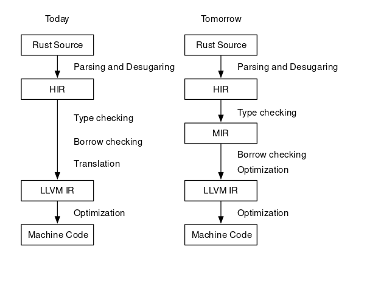
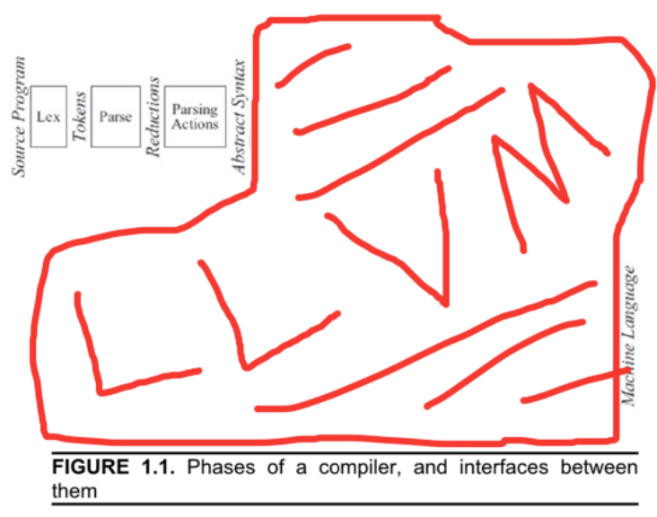

## An introduction to creating a C compiler - weicc

# 2. Calculator-level Language Creation


In the **[previous ariticle](https://angold4.org/cs/docs/weicc/1Thompson1984.html)** of this series. **I gave you some sort of "taste" of a compiler by giving a simple 30-line C program, which is a small compiler that can only generate code of add and substract operations.**

After you compile and test that code on your machine, back to the implementation, you may wonder the difference between mordern compiler and this small "compiler": they all meet the definition of a compiler.

So, what is the difference? In my opinion, like I mentioned in **[cs.1 Introduction](https://angold4.org/cs/docs/lectures/1Introduction.html)**:
> **To reduce the complexity of implementation, people divide the whole compiler into different *stages*.**

Theoretically, a single-pass, monolithic compiler structure would work, but it is also hard to implement, especially in **debugging** and **cooperating**, if you implement a compiler in this way (we did it in this 30-line code), the whole compiler is just a **Code Generator** (so-called the **Back End**). 


However, the mordern compiler, who recieves some unknown, unpredictable input stream, just like I said before, it is difficult to use a single **Code Generator** to emit code for such complex input sources.

**"Dividing compiler into multiple stages"** is a very brilliant idea, not only does it reduce the complexity of implementing a mordern compiler by making the differet stages independently, but it also make it way much easier for the student to understand a mordern compiler.

But at the same time, we should also notice the side-effects of this design choice: **It is easy to bring an illusion to the beginners that all compilers should contain these 4 or 5 different stages.** If they learn the compiler stage by stage, which means, only learn the parser after they fully understand the tokenizer, only touch code generator after they fully understand the front end, etc., I believe it is not the correct way:
1. **Since each part's output (immediate code) is used for the next part (in the other words, the earlier part "serves" the later part ), there is no "fully understand" before you touch the next part and knowing that what does it want.**

2. **In general, the compiler should never be developed from stage to stage, it always start with a full-stages, small piece of code, and after adding more features to each part gradually at the same time. Finially becomes the "complex mordern compiler".**

**In our example here, this "30-line c code" is nothing but a small code generator due to the simple and predictable input source. But if we want to add more features to this compiler, we should add more stages in order to help our code generator emit code.**

I think that is one of the correct way to understand a compiler, and what I am going to do in this Chapter is to add a **Tokenizer** and a **Parser** to our compiler in order to support more complex operations like **division** and **multiplication**.

## 1. Revisited: Modern Compilers


> **A wander through a weired landscape to the heart of compilation**

In **[cs.1 Introduction](https://angold4.org/cs/docs/lectures/1Introduction.html)**, we've talked a little bit about **Modern Compiler** and **Compiler History**. Before we really step into the actual compiler development, I want to share something related to the actual mordern industrial compilers since the gap between small "class" projects and industrial compilers seems to be overwhelming, and this huge gap may cause terror and misunderstanding when you want to write some stuff of your
own from scratch.


Many compiler experts believe that the compiler is akin to "Dinosaurs" or "Dragons" (**[Rust](https://www.rust-lang.org/) creator [Graydon Hoare](https://github.com/graydon)** mentioned that in his **[talk](http://venge.net/graydon/talks/CompilerTalk-2019.pdf)**).

* **Some are bigger and scarier.**
* **Some are weird and wonderful.**
* **Some are really tiny!**


### i. First impression: some giants

#### Clang (LLVM Project)
 
* **[Link](https://clang.llvm.org/)** | **[Source Code](https://github.com/llvm/llvm-project/tree/main/clang)**
* **Code Size: *~2m lines of C++***
    * *800k* lines clang (front end)
    * *1.2m* LLVM
* **Self hosting, bootstrapped from GCC**
* **Compile C-language family (C, C++, ObjC) to multi-target (23).**
* **Good diagnostics, fast code**
* Originally Apple, 2007-now, large multi-org team.


#### Swiftc

* **[Link](https://www.swift.org/swift-compiler/)** | **[Source Code](https://github.com/apple/swift)**
* **Code Size: *~2.5m lines of C++***
    * *530k* lines of C++ (front-end)
    * *2m* lines of clang and LLVM (swift interoprate with C/ObjC libraries)
* **Not self-hosting.**
* **Compile Swift language into multi-target.**
* **Newer app-dev language. Extra SIL IR for Swift-specific optimizations.**
* 2014-now, mostly Apple.


#### Rustc

* **[Link](https://doc.rust-lang.org/rustc/what-is-rustc.html)** | **[Source Code](https://github.com/rust-lang/rust/tree/master/compiler)**
* **Code Size: *~1.5m* lines of Rust and C++**
    * *~360k* lines of Rust.
    * *1.2m* lines of LLVM.
* **Self hosting, bootstrapped from OCaml.(ML)**
* **Compile Rust language into multi-target.**
* **Newer safe system language, the [HIR and MIR](https://blog.rust-lang.org/2016/04/19/MIR.html).**
* Originally mostly Mozilla, 2010-now, large multi-org team.




#### GNU Compiler Collection (GCC)

* **[Link](https://gcc.gnu.org/)** | **[Source Code](https://github.com/gcc-mirror/gcc)**
* **Code Size: *~2.2m* lines of mostly C, C++. *600k* lines Ada.**
* **Self hosting, bootstrapped from other C compilers.**
* **Multi-language(C, C++, ObjC, Ada, D, Go, Fortran), multi-target (21)**
* **Generates quite fast code. Language & target-agnostic TREE AST and RTL IR.**
    * Challenging to work on.
* 1987-present, large multi-org team.


### ii. Variations

#### Why so big?

**Compilers get big because the development costs are seen as justified by the benefits, at least to the people paying the bills.**

1. Developer productivity: Highly expressive languages, extensive diagnostics, IDE intergration, legacy interop.
2. **Compiled code will be released on billions of devices, and used for different purpose.**
3. **At that time, compilation time and target code executing time become very huge (optimization)**
4. Covering & exploiting all the hardware: when a new chip released, they pay for an industrial compiler to make use of it.

#### Variation #1: Optimizations

##### Fewer optimizations

In some contexts, "all the optimizations" is too much, since too much optimizations are too slow to compile, costs too much memory, too much development / maintenance effort and too inflexible.

* **Optimization** is hard, we cannot make an optimizer that do too well always.
* In some cases, (dynamic dispatch, pointer chasing): optimizer just can't do too well anyways.

##### Proebsting's law - "Compiler Advances Double Computing Power Every 18 Years


Scoott, Kevin. On Proebsting's Law. 2001

Just like Moore's law, another empirical observation. **Optimizations seem to only win ~3-5x, after *60+* years of work. And it seems less true as languages gains more abstractions to eliminate. (More true if lower-level).**


#### Variation #2: Interpretation and Compilation

You may hear that quote before: "**The CPU is the lowest level interpreter.**". In fact, **all involve compilers interacting with interpreters.**
Interpreters & Compilers actually have a long relationship! And the interpreters predate compilers. Let us travel back in time to the beginning, to illustrate!

##### 1. Origins of "Computer"


* **1940s: First digital computers** (or should call it "calculator")
* **Computers: Fixed-function machines and/or humans(largely women) doing job called "computer".**
* At that time, "Computing power" literally measured in "kilo-girls" and "kilo-girl-hours".
* Around 1945, the first general computer **ENIAC** built for US Army, doing artillery calculations in WWII.
    * Which bring a new role: "Programmers", drawn from "computer" staff, all women.
    * "Programming" at that time meant physically **rewiring** per task.

##### 2. Stored Programs


* **In 1948, [Jean Bartik](https://en.wikipedia.org/wiki/Jean_Bartik) leads team to convert ENIAC to "stored programs"**
    * which is instructions (called "orders" at that time) held in memory.
    * These instructions will be interpreted by hardware.
    * **Faster to reconfigure than rewiring, but ran slower.**
* **In 1949, The first software interpreter for ENIAC released.**
    * Short Code software interpreters for higher level "pseudo-code" instructions.
    * This pseudo-code denotes **subroutine calls and expressions**.
    * Faster to programming with, but *~50x* slower than HW-interpreted before.

An example from Wikipedia: The pseudo-code:
```
a = (b + c) / b * c
```
was converted to Short Code by a sequence of substitutions and final regrouping.
```
X3 =  (  X1 +  Y1 )  /  X1 * Y1   substitute variables
X3 03 09 X1 07 Y1 02 04 X1   Y1   substitute operators and parentheses. 
07Y10204X1Y1                      group into 12-byte words.
0000X30309X1
```
This short code was interpreted and ran about *50x* slower than machine code.

* **In 1952, [Grace Hopper](https://en.wikipedia.org/wiki/Grace_Hopper) completed the first compiler, known as the A-0.**
    * A-0 translate pseudo-codes into machine code.
    * **Results runs almost as fast as manualy coded, but as easy to write-for as interpreter.**


##### 3. Balance between Interpretation and Compilation

**All about balancing time tradeoffs!** (coding-time | compiler-execution-time | run-time).
Here we introduce two more mordern compilers as examples to illustrade this trade-off.

#### Eclipse Compiler for Java (ECJ)
* **[Link](https://www.eclipse.org/downloads/packages/release/juno/sr2/eclipse-ide-java-developers) | Not Open Source**
* **Code Size: *146k* lines Java**
* **Self-hosting, bootstrapped from javac**
* **Compile Java Code into JVM IR (Java Bytecode)**
* **Used in many Java products (e.g,. IntelliJ IDEA) Rich semantics, good diagnostics, IDE intergration**
* 2001-now, IBM, OSS.

In Eclipse example, we see a trade-off - **Stop before real machine code. Emit IR == "virtual machine" code**.
Which can be compiled or even just interpreted further. And the residual VM interpreter has several real advantages:
1. Easier to port to new hardware (Just need to make it running). (EZ Multi-platform)
2. **Faster compilation & program start up**, keeps interactive user engaged.
3. As an interpreter, it is relatively simple to write, less labour. Makes you can focus your time on frontend semantics.

As an example, from [https://xavierleroy.org/talks/zam-kazam05.pdf](https://xavierleroy.org/talks/zam-kazam05.pdf), **The general bytecode interpreters, as a cheap implementation device, offering *1/4* of the performance of optimizing native-code compilers, at *1/20* of the implementation cost.**


#### V8 Engine
* **[Link](https://v8.dev/)** | **[Source Code](https://github.com/v8/v8)**
* **Code Size: *660k* lines C++ including backends.**
* **Not self-hosting**
* **Compile Javascript code into Machine Code, Multi-target(7), Multi-tier JIT**
    * Multiple generations of optimization and IRs.
    * **Always adjusting for sweet spot of runtime performance vs. compile time, memory, maintenance cost, etc.**
* 2008-present, mostly Google.

In V8, we saw another example of balancing **Interpretation** and **Compilation** - **JIT (Just in Time) Compilation** for improved performance.

The JIT, which can be illustrate as **"Compile at runtime"**. The V8 engine is both a compiler and an interpreter. There are basically three steps involved in processing the code:

The parsing phase will generate a AST (Abstract Syntax Tree). In general, after that there are usually two ways to compile the AST into bytecode:

* **Using an Interpreter: The interpreter scans the code line by line and converts it into bytecode.**
* **Using an Compiler: The compiler scans the entire document and compiles it into highly optimized bytecode.**

The V8 engine initially uses an interpreter to interpret the code line by line. On further executions, **the V8 engine finds patterns such as frequently executed functions frequently used variables, and compiles them to improve preformance.**


## 2. Tokenizer

## 3. Parser

**The output of the parser (tree-like structure) shows the order in which the operations in the code are to be performed.**


## Aside: what is this "LLVM"?

Notice that the first 3 languages in the first part of this article are end in [LLVM](https://github.com/llvm/llvm-project). "Low Level Virtual Machine".

* Strongly typed IR, serialization format, library of optimizations, lowering to many target architectures.
* **"One-stop-shop" for compiler backends.**: LLVM IR => Multi-target
* 2003-now, UIUC at first, many industrial contributors now.
* **Longstanding dream of compiler engineering world, possibly most successful attempt at it yet!**

Here is a funny diagram of modern compilers from Andi McClure [https://runhello.com/](https://runhello.com/).



If you are interested in LLVM, and how does it works, you may refer to this **[slide](../../uc/llvmIR/MIT6_172F18_lec5.pdf).**

Here is a procedure for you to test the llvm IR code:

### 1. Create file `fib.c`

Please copy the [fib.c](../../uc/llvmIR/fib.c) into the directory you want to work in.


### 2. Using clang to generate llvm IR code
```
clang -S -emit-llvm fib.c
```
Now the [fib.ll](../../uc/llvmIR/fib.ll) contains the IR code, which can be used to generate further muti-platform code.

### 3. Using weicc to generate corresponding assembly code (optional)

If you want to check the difference between actual assembly code and this LLVM IR code, you may use our weicc to compile that c file.
For this, I already put an executable file (`weicc`) here: **[weicc](https://github.com/Angold-4/cs/blob/main/uc/llvmIR/weicc?raw=true)**.
If you want to compile weicc from source, just clone the latest source from github [https://github.com/Angold-4/weicc](https://github.com/Angold-4/weicc) and build your own using Makefile.

After that, emit assembly code by executing:
```
./weicc -o fib2.s fib.c
```

## References
1. [Slides](http://venge.net/graydon/talks/CompilerTalk-2019.pdf) of a talk related to compilers in March 26, 2019 at UBC by [Gradon Hoare](https://github.com/graydon).
2. [History of programming language from Wikipedia](https://en.wikipedia.org/wiki/History_of_programming_languages)
3. [Geeksforgeeks How V8 compiles javascript code?](https://www.geeksforgeeks.org/how-v8-compiles-javascript-code/)

