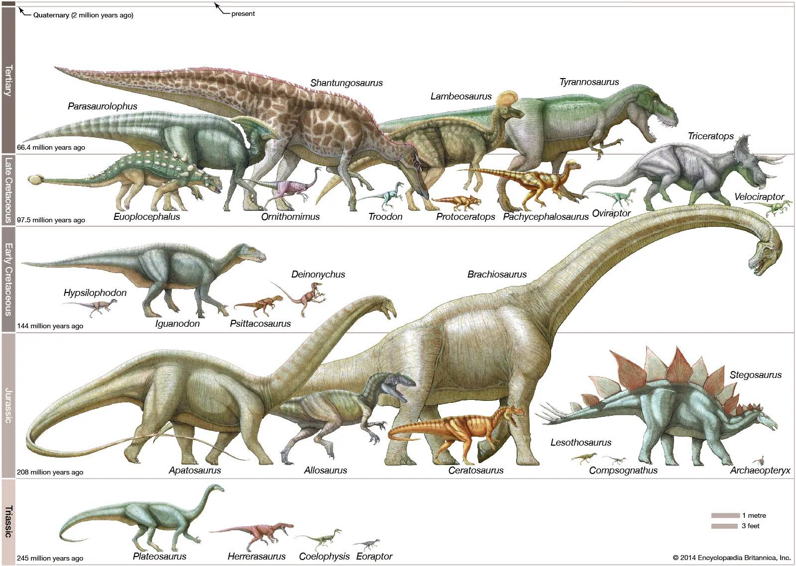

## An introduction to creating a C compiler - weicc

# 2. Calculator-level Language Creation

In the **[previous ariticle](https://angold4.org/cs/docs/weicc/1Thompson1984.html)** of this series. **I gave you some sort of "taste" of a compiler by giving a simple 30-line C program, which is a small compiler that can only generate code of add and substract operations.**

After you compile and test that code on your machine, back to the implementation, you may wonder the difference between mordern compiler and this small "compiler": they all meet the definition of a compiler.

So, what is the difference? In my opinion, like I mentioned in **[cs.1 Introduction](https://angold4.org/cs/docs/lectures/1Introduction.html)**:
> **To reduce the complexity of implementation, people divide the whole compiler into different *stages*.**

Theoretically, a single-pass, monolithic compiler structure would work, but it is also hard to implement, especially in **debugging** and **cooperating**, if you implement a compiler in this way (we did it in this 30-line code), the whole compiler is just a **Code Generator** (so-called the **Back End**). 

However, the mordern compiler, who recieves some unknown, unpredictable input stream, just like I said before, it is difficult to use a single **Code Generator** to emit code for such complex input sources.

**"Dividing compiler into multiple stages"** is a very brilliant idea, not only does it reduce the complexity of implementing a mordern compiler by making the differet stages independently, but it also make it way much easier for the student to understand a mordern compiler.

But at the same time, we should also notice the side-effects of this design choice: **It is easy to bring an illusion to the beginners that all compilers should contain these 4 or 5 different stages.** If they learn the compiler stage by stage, which means, only learn the parser after they fully understand the tokenizer, only touch code generator after they fully understand the front end, etc., I believe it is not the correct way:
1. **Since each part's output (immediate code) is used for the next part (in the other words, the earlier part "serves" the later part ), there is no "fully understand" before you touch the next part and knowing that what does it want.**

2. **In general, the compiler should never be developed from stage to stage, it always start with a full-stages, small piece of code, and after adding more features to each part gradually at the same time. Finially becomes the "complex mordern compiler".**

**In our example here, this "30-line c code" is nothing but a small code generator due to the simple and predictable input source. But if we want to add more features to this compiler, we should add more stages in order to help our code generator emit code.**

I think that is one of the correct way to understand a compiler, and what I am going to do in this Chapter is to add a **Tokenizer** and a **Parser** to our compiler in order to support more complex operations like **division** and **multiplication**.

## 1. Revisited: Modern Compilers

> **A wander through a weired landscape to the heart of compilation**

In **[cs.1 Introduction](https://angold4.org/cs/docs/lectures/1Introduction.html)**, we've talked a little bit about **Modern Compiler** and **Compiler History**. Before we really step into the actual compiler development, I want to share something related to the actual mordern industrial compilers since the gap between small "class" projects and industrial compilers seems to be overwhelming, and this huge gap may cause terror and misunderstanding when you want to write some stuff of your
own from scratch.

Many compiler experts believe that the compiler is akin to "Dinosaurs" or "Dragons" (**[Rust](https://www.rust-lang.org/) creator [Graydon Hoare](https://github.com/graydon)** mentioned that in his **[talk](http://venge.net/graydon/talks/CompilerTalk-2019.pdf)**).

* **Some are bigger and scarier.**
* **Some are weird and wonderful.**
* **Some are really tiny!**

### i. First impression: some giants

#### Clang (LLVM Project)
 
* **[Link](https://clang.llvm.org/)** | **[Source Code](https://github.com/llvm/llvm-project/tree/main/clang)**
* **Code Size: *~2m lines of C++* **
    * *800k* lines clang (front end)
    * *1.2m* LLVM
* **Self hosting, bootstrapped from GCC**
* **Compile C-language family (C, C++, ObjC) to multi-target (23).**
* **Good diagnostics, fast code**
* Originally Apple, 2007-now, large multi-org team.

#### Swiftc

* **[Link](https://www.swift.org/swift-compiler/)** | **[Source Code](https://github.com/apple/swift)**
* **Code Size: *~2.5m lines of C++* **
    * *530k* lines of C++ (front-end)
    * *2m* lines of clang and LLVM (swift interoprate with C/ObjC libraries)
* **Not self-hosting.**
* **Compile Swift language into multi-target.**
* **Newer app-dev language. Extra SIL IR for Swift-specific optimizations.**
* 2014-now, mostly Apple.

#### Rustc

* **[Link](https://doc.rust-lang.org/rustc/what-is-rustc.html)** | **[Source Code](https://github.com/rust-lang/rust/tree/master/compiler)**
* **Code Size: *~1.5m* lines of Rust and C++**
    * *~360k* lines of Rust.
    * *1.2m* lines of LLVM.
* **Self hosting, bootstrapped from OCaml.(ML)**
* **Compile Rust language into multi-target.**
* **Newer safe system language, the [HIR and MIR](https://blog.rust-lang.org/2016/04/19/MIR.html).**
* Originally mostly Mozilla, 2010-now, large multi-org team.

#### GCC

## 2. Tokenizer

## 3. Parser

## Aside: what is this "LLVM"?

Notice that the first 3 languages in the first part of this article all end in [LLVM](https://github.com/llvm/llvm-project). "Low Level Virtual Machine".

* Strongly typed IR, serialization format, library of optimizations, lowering to many target architectures.
* **"One-stop-shop" for compiler backends.**: LLVM IR => Multi-target
* 2003-now, UIUC at first, many industrial contributors now.
* **Longstanding dream of compiler engineering world, possibly most successful attempt at it yet!**

## References
1. **[Slides](http://venge.net/graydon/talks/CompilerTalk-2019.pdf) of a talk related to compilers in March 26, 2019 at UBC by [Gradon Hoare](https://github.com/graydon).**

